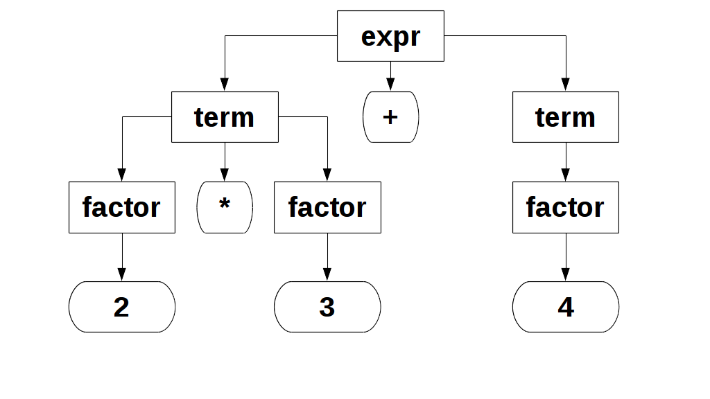

- title : funktionales C# praktisch demonstriert
- description : funktionales C# am Beispiel einer einfachen Parser-Kombinator Library
- author : Carsten König
- theme : beige
- transition : default

***

## funktionales C# praktisch demonstriert

<br />
<br />

#### am Beipspiel Parser-Kombinatoren

<br />
<br />

Carsten König - [@CarstenK_dev](http://www.twitter.com/carstenk_dev)

***

### Agenda

- Was sind Parser
- *funktionale* Parser-Kombinatoren in C#
- Beispiel Taschenrechner `2 * 3 + 4` -> `= 10`

' Speakernotes here please

***

### Was ist ein Parser?

ein **Parser** versucht eine *Eingabe* in eine für die Weiterverarbeitung geeignete
*Ausgabe* umzuwandeln.

---

#### Beispiel

Eingabe: **Quelltext**

Ausgabe: **Syntaxbaum**

---

##### von

> 2 * 3 + 4

---

##### 2 * 3 + 4



---

### manuell

einfache Parser direkt durch Funktionen implementieren (siehe [wikipedia](https://en.wikipedia.org/wiki/Recursive_descent_parser#C_implementation))

```c
void term(void) {
    factor();
    while (sym == times || sym == slash) {
        nextsym();
        factor();
    }
}

void expression(void) {
    if (sym == plus || sym == minus)
        nextsym();
    term();
    while (sym == plus || sym == minus) {
        nextsym();
        term();
    }
}
```

---

### Compiler-Compiler (Grammatik)

übersetzen ein Grammatik wie

```text
expr   ::= expr addop term | term
term   ::= term mulop factor | factor
factor ::= Zahl | ( expr )
addop  ::= + | -
mulop  ::= * | /
```

in eine *state-machine* in der *Zielsprache*

---

### Compiler-Compiler

- [YACC](https://de.wikipedia.org/wiki/Yacc) 
- [ANTLR](https://de.wikipedia.org/wiki/ANTLR)

***

### funktionaler Parser

> Umsetzung als *parser combinator* Bibliothek

---

### funktionaler Parser

#### Kombinator?


*Funktionen* die *Parser* zu neuen *Parser*n zusammensetzen

---

#### Dazu

- Parser als Datenstruktur darstellen
- *Kombinatoren* als **Funktionen** dieser Datenstrukturen schreiben

***

## Parser

### Bausteine

---

### was ist ein Parser-Baustein?

*sieht* die **Eingabetoken** und *berechnet* einen **Ausgabewert**

---

#### soll kombinbar sein

**⟹** erkennt / *konsumiert* vielleicht nur einen Teil der Eingabe

**⟹** *Rückgabe* des Parsers soll den Rest der *Eingabe* anzeigen

---

### Definition Parser

- bekommt als *Eingabe* eine **Position** innerhalb des *Quelltextes*
- *Ausgabe* ist **neue** Position *zusammen* mit **erkannten Wert**


---

### in Code

```csharp
delegate ParserResult<T> Parser<T>(ParserPosition position);
```

---

### ParserPosition

```csharp
delegate ParserResult<T> Parser<T>(ParserPosition position);

class ParserPosition
{
    public string Text { get; }
    public int Index { get; }
    public char? CurrentChar { get {...} }
    public ParserPosition Next () { ... }
    ...
}
```

---

### functional

`ParsePosition` ist **immutable**

```csharp
    public string Text { get; }

    public ParserPosition Next () { ... }
```

---

### aber `null`?

```csharp
    public char? CurrentChar { get {...} }
```

zumindest mit *Resharper* und C# 6 (`?.`,`??`, ...) **ok**

---

#### ParserResult

*OOP* Version eines **Co**-*Produkts*

```csharp
abstract class ParserResult<T>
{
    public static ParserResult<T> 
	   Succeed(T value, ParserPosition rest) { ... }
	   
    public static ParserResult<T> 
	   Failed(string error, ParserPosition position) { ... }
	   
    private class Success : ParserResult<T> { ... }
    private class Failure : ParserResult<T> { ... }
}

```

' - ein **Produkt** ist ein Tupel, Record, ...
' - also ein Wert A **und** ein Wert B, ...
' - ein Coprodukt/SumType/... ist ein **Entweder-Oder**

---

### Wie an die Werte kommen?

```csharp
abstract class ParserResult<T>
{
    abstract TRes Match<TRes> (
        Func<T, ParserPosition, TRes> onSuccess, 
        Func<string, ParserPosition, TRes> onFailure );
	...
	
    class Success {

         private T Value { get; }
	
         public override TRes Match<TRes> (
             Func<T, ParserPosition, TRes> onSuccess, 
             Func<string, ParserPosition, TRes> onFailure )
         {
             return onSuccess(Value, RestText);
         }
```

' **Vorteil:** *total* (nicht partiell) - kann keinen *Fall* vergessen.

---

### ParserResult ist ein Funktor

**Beispiel**

```csharp
	ParserResult<string> textResult = ...
	ParserResult<int> zahlResult =
	    textResult.Map(int.Parse);
```

- falls `Failure<string>` gibt `Failure<int>`
- falls `Success<string>` mit Wert `s` gibt `Success<int>` mit Wert `int.Parse(s)`

---

### ParserResult ist ein Funktor

```csharp
abstract class ParserResult<T>
{
    ParserResult<TRes> Map<TRes>(Func<T, TRes> map)
    {
       return Match(
	       onSuccess: (v,r) => 
		       ParserResult<TRes>.Succeed( map(v), r ),
	       onFailure: ParserResult<TRes>.Failed);
    }
```

---

### Funktor Gesetze

muss eine Reihe *Gesetze* erfüllen:

- `result.Map(x => x)` ist das Gleiche wie `result`
- `result.Map(x => g(f(x)))` ist das Gleiche wie `result.Map(f).Map(g)`

---

#### weitere Beispiele

- `IEnumerable<T>` (mit `Enumerable.Select`)
- `Task<T>` mit

```csharp
async Task<TRes> Map<T,TRes>(Task<T> task, Func<T,TRes> map)
{
    var result = await task;
    return map(result);
}
``` 

***

### Parser benutzen

Wie bekomme ich das `ParserResult` zu einem *Eingabestring*?

---

### parsen

```csharp
delegate ParserResult<T> Parser<T>(ParserPosition position);

public static class ParserPosition
{
        public static TRes TryParse<T, TRes>(
            this Parser<T> parser, string text, 
            Func<T, TRes> onSuccess,
            Func<string, ParserPosition, TRes> onFailure)
        {
            var start = ParserPosition.StarteMit(text);
            var result = parser(start);
            return 
                result.Match((v, _) => onSuccess(v), onFailure);
        }
```
---

### Exception falls gescheitert

```csharp
public static T Parse<T>(this Parser<T> parser, string text)
{
    return
        parser.TryParse(text,
            onSuccess: x => x,
            onFailure: (err, p) => throw new Exception(err));
}

```

***

### Parser kombinieren

---

#### Erinnerung: Kombinator

> Funktionen,
>
> die *Parser* als **Eingabe** *erhalten können*
> 
> und *Parser* **zurückgeben**

---

#### einfache Kombinatoren

```csharp
delegate ParserResult<T> Parser<T>(ParserPosition position);


Parser<T> Return<T>(T value)
{
    return pos => ParserResult<T>.Succeed(value, pos);
}

Parser<T> Fail<T>(string error)
{
    return pos => ParserResult<T>.Failed(error, pos);
}

```

---

#### einzelnes Zeichen

```csharp
Parser<char> SingleChar()
{
    return pos =>
    {
        if (!pos.CurrentChar.HasValue)
            return ParserResult<char>
               .Failed("Unerwartetes Ende der Eingabe", pos);

        var zeichen = pos.CurrentChar.Value;
        return ParserResult.Succeed(zeichen, pos.Next());
    };
}
```

**bitte beachten**: hier wir die Position vorgerrückt

---

#### ein Zeichen parsen, dass eine Eigenschaft erfüllt

```csharp

Parser<char> Satisfy(Func<char, bool> property)
{
    return pos =>
    {
        if (!pos.CurrentChar.HasValue)
            return ParserResult<char>
               .Failed("Unerwartetes Ende der Eingabe", pos);

        var zeichen = pos.CurrentChar.Value;

        return !property(zeichen)
            ? ParserResult<char>.Failed(
                   $"Zeichen [{zeichen}] erfüllt Bedingung nicht", pos)
            : ParserResult<char>.Succeed(zeichen, pos.Next());
    };
}
```

---

#### Funktor

**erbt** die Funktor-Eigenschaft von `ParserResult`

```csharp
Parser<TRes> Map<T, TRes>(this Parser<T> parser, Func<T, TRes> map)
{
    return pos => parser(pos).Map(map);
}

```
---

#### erbt?

- `ParserResult<_>` ist ein Funktor
- `Func<T, _>` ist ein **Funktor**
- und die Komposition von *Funktoren* ist wieder ein Funktor

---

- `Func<T, _>` ist ein **Funktor**

```csharp
Func<T,Tb> Map<T,Ta,Tb>(Func<T,Ta> f, Func<Ta,Tb> map)
{
    return t => map( f(t) );
}

```
---

### Entweder-Oder Kombinator

**Idee:** versuche einen Parser, falls dieser
erfolgreich ist verwende dessen Ergebnis

**sonst** benutze einen *alternativen* Parser (hier *backtracking*)

```csharp
Parser<T> Choice<T>(Parser<T> parserA, Parser<T> parserB)
{
    return pos => 
	    parserA(pos).Match(
            onSuccess: ParserResult<T>.Succeed,
            onFailure: (err, _) => parserB(pos));
}

```

---

### nacheinander parsen

**Idee:** die *Position* nach dem Parsen des **ersten**,
als Eingabe für den **zweiten** Parser nutzen.

```csharp
// pseudo
ParserPosition pos =>
{
    var result1 = parser1(pos);
    var result2 = parser2(result1.Position);
    ...
}
```

**Aber:** *was* mit dem *Wert* von `result1` machen?

---

#### Parser - *Factory*

nicht *einfach* zweiter Parser **sondern** 

    Func<Tausgabe1, Parser<Tausgabe>> factory

```csharp
// pseudo
ParserPosition pos =>
{
    var result1 = parser1(pos);
    var parser2 = factory(result1.Wert);
    var result2 = parser2(result1.Position);
    ...
}
```

---

#### Monade

```csharp
Parser<T> Return<T>(T value) {...}

Parser<TRes> Bind<T, TRes>( 
       this Parser<T> parser, Func<T, 
       Parser<TRes>> bind)
{
    return pos => parser(pos)
        .Match(
            onSuccess: (v, p) => bind(v)(p),
            onFailure: ParserResult<TRes>.Failed
        );
}
```

' gibt auch einige Gesetze - heute **ignorieren**

---

### Many Kombinator

```csharp
Parser<IEnumerable<T>> Many<T>(this Parser<T> parser)
{
    var leererParser = Return(Enumerable.Empty<T>());
    return Choice(Many1(parser), leererParser);
}

Parser<IEnumerable<T>> Many1<T>(this Parser<T> parser)
{
    return parser.Bind(item =>
        Many(parser).Map(items => 
            // item vor items hängen
            new[] {item}.Concat(items)));
}
```

' **Nachteil:** Schachtelung, zuviel *buzz*

---

#### wäre schöner

```csharp
Parser<IEnumerable<T>> Many1<T>(this Parser<T> parser)
{
    return 
        from item in parser
        from items in Many(parser)
        select new[] {item}.Concat(items);
}
```

---

#### dafür

```csharp
Parser<TRes> SelectMany<TSrc, TRes>(
    this Parser<TSrc> source, 
    Func<TSrc, Parser<TRes>> selector)
{
    return source.Bind(selector);
}


Parser<TRes> SelectMany<TSrc, TCol, TRes>(
    this Parser<TSrc> source,
    Func<TSrc, Parser<TCol>> collectionSelector, 
    Func<TSrc, TCol, TRes> resultSelector)
{
    return pos => source(pos)
        .Match(
            onSuccess: (src, p) => 
                collectionSelector(src)(p)
                .Map(col => resultSelector(src, col)),
            onError: ParserResult<TRes>.Failed);

}
```

---

### Chains

**Ziel:** Eingaben der Form

    element ° element ° ... ° element
	
parsen, wobei

- `element` ein `Parser<T>`
- der Operator `°` ein `Parser<Func<T,T,T>>`
- Ergebnis den Operator-Wert *links-assoziativ* verknüpft wird `(element ° element) ° element`

---

#### Chains

```csharp
Parser<T> Chainl1<T>(this Parser<T> elemParser, Parser<Func<T, T, T>> opParser)
{
    Parser<T> Rest(T a)
    {
        var more =
            from f in opParser
            from b in elemParser
            from r in Rest(f(a, b))
            select r;

        return Choice(more, Return(a));
    }

    return
        from x in elemParser
        from y in Rest(x)
        select y;
}
```

***

## Taschenrechner

---

## DEMO

```
> 2 * 3 + 4
10
```

---

### Erinnerung


---

### Grammatik

wollen folgende Grammatik parsen:

```
expr   ::= expr addop term | term
term   ::= term mulop factor | factor
factor ::= int | ( expr )
int    ::= - digits | digits
digit  ::= (0 | 1 | . . . | 9)*
addop  ::= + | -
mulop  ::= * | /
```
--- 

### Tokens

```
addop  ::= + | -
mulop  ::= * | /
int    ::= - digits | digits
digit  ::= (0 | 1 | . . . | 9)*
```

---

#### Symbol

parst genau ein Zeichen und ignoriert *whitespace* dahinter

```csharp
Parser<char> Symbol(char symbol)
{
    return Parsers
        .Satisfy(c => symbol == c)
        .IgnoreWhitespaceRight()
        .ErrorText($"{symbol} erwartet");
}
``` 

---

```csharp
Parser<T> IgnoreWhitespaceRight<T>(this Parser<T> parser)
{
    return
        from p in parser
        from s in _whitespace
        select p;
}

...

Parser<string> _whitespace = Parsers
    .Satisfy(char.IsWhiteSpace)
    .Many()
    .Map(ToString);

```

---

### Ganzzahl Parser

```csharp
Parser<int> Int { get {

    var sign = Parsers
        .Choice(
            Symbol('-').Const<char, Func<int, int>>(x => -x),
            Parsers.Return<Func<int, int>>(x => x))
        .ErrorText("- oder Ziffer erwartet");

    var digits = Parsers
        .Satisfy(char.IsDigit)
        .Many1()
        .Map(ToString)
        .Map(int.Parse)
        .ErrorText("Ziffer erwartet");
		
    return 
        sign.Apply(digits).IgnoreWhitespaceRight();
		
    }
}
```

---

#### MulOp / AddOp

über `Choice` und `Symbol`

```csharp
Parser<Func<int, int, int>> MulOp
{
    get
    {
        Func<int,int,int> mul = (x,y) => x*y;
        Func<int,int,int> div = (x,y) => x/y;
		
        return Choice(
                Tokens.Symbol('*')
                   .Const<char, Func<int, int, int>>(mul),
                Tokens.Symbol('/')
                   .Const<char, Func<int, int, int>>(div)
            ).ErrorText("* oder / erwartet");
    }
}

```

---

### Syntax


    expr   ::= expr addop term | term
    term   ::= term mulop factor | factor

```csharp
Parser<int> Expression => 
    Term.Chainl1(AddOp);


Parser<int> Term => 
    Factor.Chainl1(MulOp);
```

---

    factor ::= int | ( expr )

```csharp
Parser<int> Factor
{
    get
    {
        var inParents =
                from l in Tokens.Symbol('(')
                from i in Expression
                from r in Tokens.Symbol(')')
                select i;

        return Choice(Tokens.Int, inParents)
            .ErrorText("( oder Ganzzahl erwartet");
    }
}
```

' **Vorsicht** das Funktioniert nur weil *LINQ* hier
' über einen Expression-Tree arbeitet - sonst gäbe
' Expression direkt einen StackOverflowException

***

### Blick über den Tellerrand

- F#: [FParsec](http://www.quanttec.com/fparsec/)
- Elm (`bind` = `andThen`):
    - Parser [elm-combine](http://package.elm-lang.org/packages/Bogdanp/elm-combine/latest)
    - Json [Decoder](http://package.elm-lang.org/packages/elm-lang/core/5.1.1/Json-Decode)/Encoder
    - [Random](http://package.elm-lang.org/packages/elm-lang/core/5.1.1/Random)

***

### Referenzen

- G. Hutton, E. Meijer [Monadic Parsing in Haskell](http://www.cs.nott.ac.uk/~pszgmh/pearl.pdf)
- G. Hutton, E. Meijer [Monadic Parser Combinators](http://www.cs.nott.ac.uk/~pszgmh/monparsing.pdf)

***

# Thank you!

